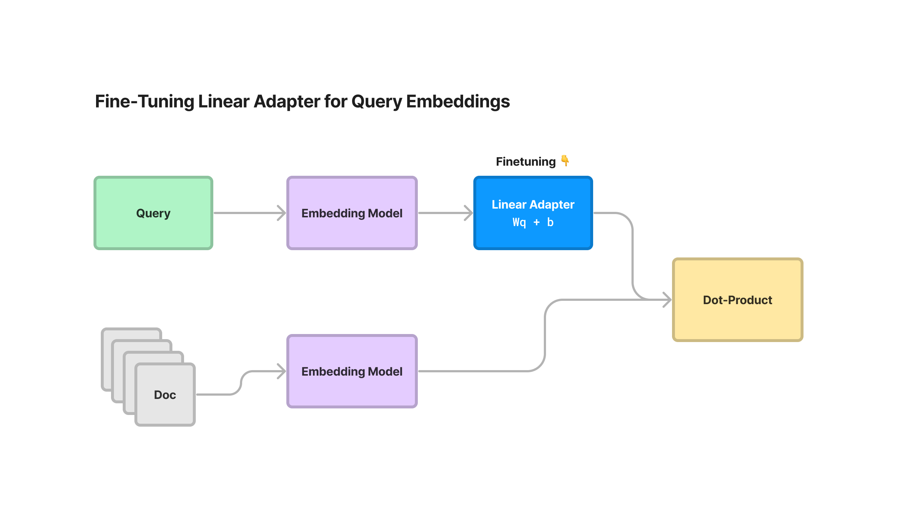
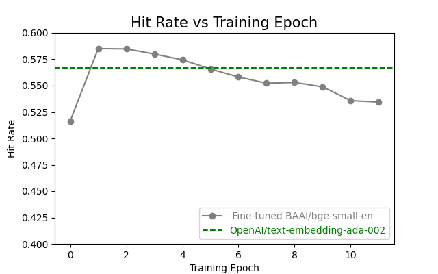
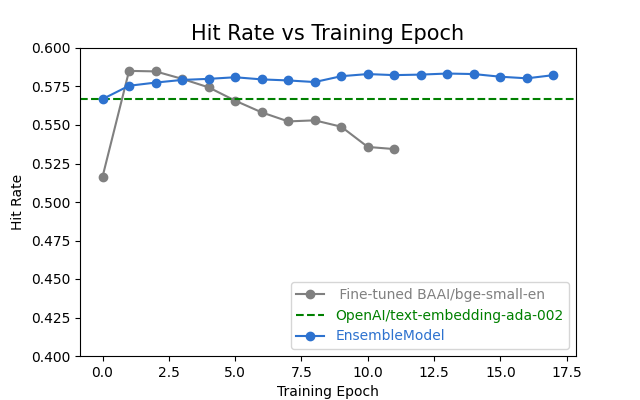
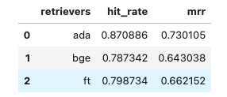

# Overview #

A pattern for fine-tuning an embedding model using synthetic Q&A pairs generated using Llama.

Tuning a text embeddings model can enable your model to adapt to the embeddings to a specific domain or task. This can be useful if the pre-trained embeddings model is not well-suited to your specific needs. For example, you might fine-tune an embeddings model on a specific dataset of customer support tickets for your company. This could help a chatbot understand the different types of customer support issues your customers typically have, and be able to answer their questions more effectively. Without tuning, the model doesn't know the specifics of your customer support tickets or the solutions to specific problems for your product.

Fine-tuned embedding models are well documented for outperforming their pretrained equivalents, and thus an important component for any retrieval system (RAG). Finetuning gives you a 5-10% increase in retrieval evaluation metrics. You can then plug this fine-tuned model into your RAG application with LlamaIndex (which this solution currently uses).


# Architecture #


## Solution Architecture ##



EmbeddingAdapterFinetuneEngine fine-tunes a linear adapter on top of query embeddings produced by any model. The linear adapter is simply a linear transformation that specifically transforms the query embedding while keeping document embeddings fixed.

The linear adapter can be used on top of any existing embeddings model: SBERT embeddings, OpenAI embeddings, Cohere embeddings, and more. As a result you can just plug this in on top of any embedding model that you’re already using.

As mentioned above, the linear adapter simply performs a linear transformation on top of the query embedding while keeping the Document embeddings fixed (with a weight matrix W + bias term b):


And that’s it! If document embeddings can be represented as a (n x d) matrix D, where n is number of documents and d is the embedding dimension, then embedding similarity is just measured by


The linear adapter is trained using a similar loss term as the MultipleNegativesRankingLoss function in sentence_transformers — given a batch of positive (question, context) examples, the function uses cross-entropy loss under the hood to penalize the ground-truth (question, context) pairs for being far apart and swapped pairs for being too close.


# Synthetic Data #

In order for our embedding model to be trained, we need training data that represents samples from our domain knowledge base. This is traditional a difficult task since ground truth training data typically needs to be labeled. Synthetic data to the rescue!

We can use synthesized Q&A pairs via a large language model (Llama) to do the heavy lifting for us. This is made simple using the LlamaIndex generate_qa_embeddings abstraction:


```python
from llama_index.finetuning import (
    generate_qa_embedding_pairs,
    EmbeddingQAFinetuneDataset,
)

# generate
train_dataset = generate_qa_embedding_pairs(train_nodes)
val_dataset = generate_qa_embedding_pairs(val_nodes)

# save
train_dataset.save_json("train_dataset.json")
val_dataset.save_json("val_dataset.json")

# load 
train_dataset = EmbeddingQAFinetuneDataset.from_json("train_dataset.json")
val_dataset = EmbeddingQAFinetuneDataset.from_json("val_dataset.json")
```

Once the job is completed, we'll have our train and validation sets constructed for us without the need to manually label.

# Fine Tuning our Linear Adapter #

Next step after synthesizing our Q&A pairs is to train our linear adapter mentioned above.

In this example we use the bge-small-en sentence-transformers model, but we can also use any embedding model in LlamaIndex/LangChain as well as the OpenAI text-embedding-ada-002 model:


```python
from llama_index.finetuning import EmbeddingAdapterFinetuneEngine
from llama_index.embeddings import resolve_embed_model
import torch

base_embed_model = resolve_embed_model("local:BAAI/bge-small-en")
# alternative: use OpenAI
# from llama_index.embeddings import OpenAIEmbedding
# openai = OpenAIEmbedding()

finetune_engine = EmbeddingAdapterFinetuneEngine(
    train_dataset,
    base_embed_model,
    model_output_path="&lt;model_output_path&gt;",
    epochs=4,
    verbose=True,
    # can optionally pass along any parameters that go into `train_model`
    # optimizer_class=torch.optim.SGD,
    # optimizer_params={"lr": 0.01}
)

finetune_engine.finetune()

```

Once tuned, we'll end up with a linear adapter that can be used in conjunction with a pretrained model to produce our domain adapted embeddings. 

The above is a basic example using a small, tunable opensource embedding model which may not yield the best results for your use case. For more advanced use cases where better performance is required, the model can be further improved by leveraging a trained ensemble which this repo also includes in the composed_fine_tune.py example:


```python

import argparse
import os
from sentence_transformers import SentenceTransformer
from eval_utils import evaluate
import json
from torch.utils.data import DataLoader
import pandas as pd
from tqdm import tqdm
from eval_utils.loss import *
from eval_utils.embedding import *
import pickle
from eval_utils.utils import *
from torch.utils.data import DataLoader
import numpy as np

seed=100
torch.backends.cudnn.deterministic = True
torch.backends.cudnn.benchmark = False
torch.manual_seed(seed)
np.random.seed(seed)

batch_size = 20
device = 'cuda:0'


AUGMENTED_MODEL_NAME="BAAI/bge-base-en-v1.5"

# Datasets
TRAIN_DATASET_FPATH = 'train_dataset.json'
VAL_DATASET_FPATH = 'val_dataset.json'

with open(TRAIN_DATASET_FPATH, 'r+') as f:
    train_dataset = json.load(f)
with open(VAL_DATASET_FPATH, 'r+') as f:
    val_dataset = json.load(f)
corpus = train_dataset['corpus']
queries = train_dataset['queries']
relevant_docs = train_dataset['relevant_docs']


results_folder = f'save/FAE/'
if not os.path.exists(results_folder):
    os.makedirs(results_folder)


# Load the saved openai embeddings
with open('data/train_query_openai.pkl', 'rb') as f:
    train_query_openai_dict = pickle.load(f)

with open('data/train_corpus_openai.pkl', 'rb') as f:
    train_corpus_openai_dict = pickle.load(f)
    
examples = []
for query_id, query in queries.items():
    node_id = relevant_docs[query_id][0]
    text = corpus[node_id]
    example = FAEExample(texts=[query, text], given_embeddings=[train_query_openai_dict[query_id],train_corpus_openai_dict[node_id]])
    examples.append(example)
loader = DataLoader(examples, batch_size=batch_size)


encoder=OpenAIEncoder()
hit_rate_temp = evaluate.evaluate(val_dataset, encoder,if_load=True)
print(f"OPENAI - Hit Rate: {hit_rate_temp:.6f}")


model = SentenceTransformer(AUGMENTED_MODEL_NAME).to(device)
model.smart_batching_collate= fae_smart_batching_collate(model)
loss=FAEMultipleNegativesRankingLoss(model)


MAX_EPOCHS = 20
previous_hit_rate = 0
hit_rates = []

encoder=FAEEncoder(model_name=AUGMENTED_MODEL_NAME)
hit_rate_temp = evaluate.evaluate(val_dataset, encoder,if_load=True)
print(f"Pretrained model - Hit Rate: {hit_rate_temp:.6f}")
hit_rates.append(hit_rate_temp)
previous_hit_rate=hit_rate_temp


for epoch in range(1, MAX_EPOCHS + 1):
    if epoch != 1:
        model = SentenceTransformer(os.path.join(results_folder, f'epoch_{epoch-1}')).to(device)
        model.smart_batching_collate= fae_smart_batching_collate(model)
        loss=FAEMultipleNegativesRankingLoss(model)


    model_output_path = os.path.join(results_folder, f'epoch_{epoch}')
    print(f"Epoch {epoch} - Training Start")
    model.fit(train_objectives=[(loader, loss)], 
              epochs=1, 
              show_progress_bar=True,
              evaluation_steps=50,
              warmup_steps=int(len(loader) * 0.1), 
              output_path=model_output_path)
    

    print(f"Epoch {epoch} - Evaluation Start")
    encoder=FAEEncoder(model_name=model_output_path)
    hit_rate_temp = evaluate.evaluate(val_dataset, encoder, if_load=True)
    hit_rates.append(hit_rate_temp)

    print(f"Epoch {epoch} - Hit Rate: {hit_rate_temp:.6f}")

    ### Conditions for early stop
    if hit_rate_temp > previous_hit_rate:
        previous_hit_rate = hit_rate_temp
        consecutive_no_improve_epochs = 0
    else:
        consecutive_no_improve_epochs += 1

    if consecutive_no_improve_epochs >= 4:
        print("Early stopping due to no improvement in hit rate.")
        break

print(hit_rates)
with open('evaluations/fae_eval.npy', 'wb') as f:
    np.save(f, hit_rates)


```

# Evaluation #

Now that we have our trained linear adapter, we need to evaluate its performance. The most common metrics for doing so are the Hit Rate and Mean Recipricol Rank:

** Hit-rate metric: ** For each (query, context) pair, we retrieve the top-k documents with the query. It’s a hit if the results contain the ground-truth context.

** Mean Reciprocal Rank: ** A slightly more granular ranking metric that looks at the “reciprocal rank” of the ground-truth context in the top-k retrieved set. The reciprocal rank is defined as 1/rank. Of course, if the results don’t contain the context, then the reciprocal rank is 0.

Taking a look at how our simple BAAI/bge-small-en and more advanced FAE (composed) ensemble model performed, we can see our hit-rate on our domain adapted model outperformed by a small margin:

## Evaluation on Simple BAAI/bge-small-en Finetuning ##


## Evaluation on Advanced FAE Ensemble Model ##



If we look at both hit-rate and mean reciprical rank for our simple fine-tuned embedding model versus the base pretrained model and the text-embedding-ada-002, we can see the model has improved:



These models can be further improved by creating additional ground-truths (either synthetically or through manual curation) but more importantly, can be hosted on cost effective hardware without the per token costs associated with using a closed source embedding model.

